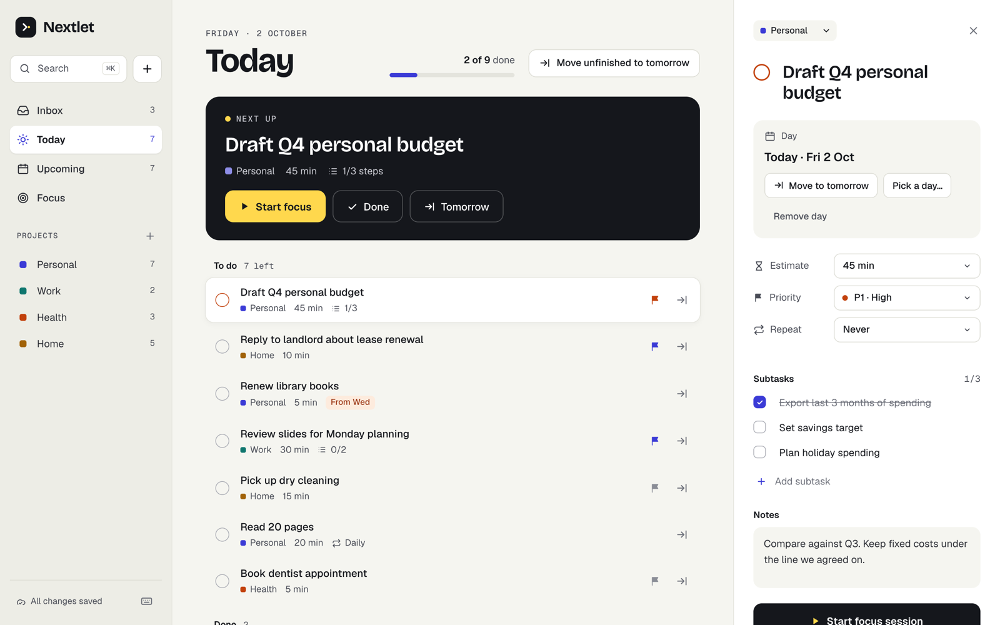
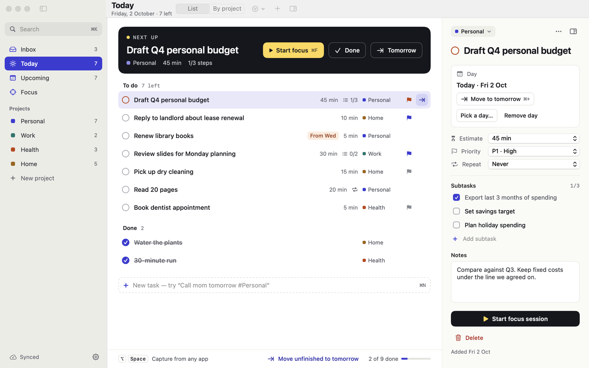
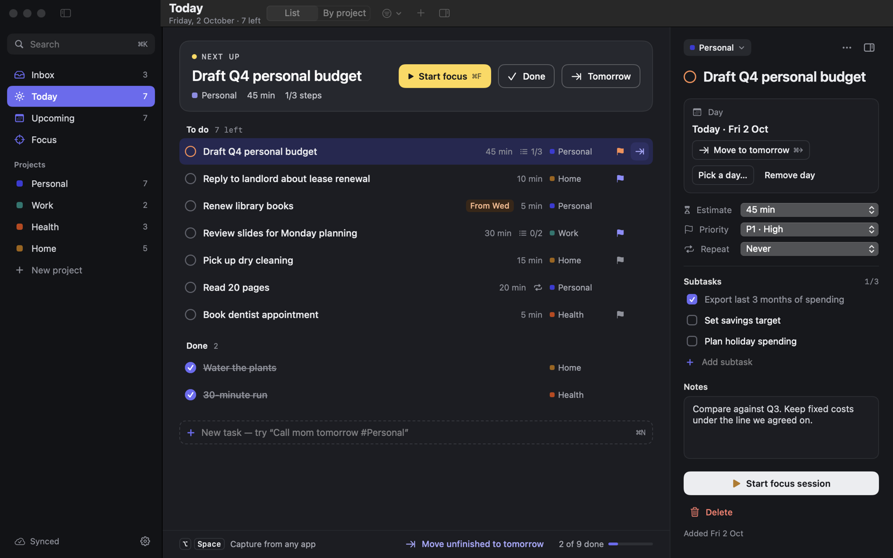

<p align="center">
  
</p>

<h1 align="center">Nextlet</h1>

<p align="center">
  A personal task manager for <b>what's next</b>.<br>
  Tasks belong to a day, not an hour, and anything can move to tomorrow in one click.
</p>

<p align="center">
  
</p>

<table>
  <tr>
    <td></td>
    <td></td>
  </tr>
  <tr>
    <td align="center">Mac app</td>
    <td align="center">…and in dark mode</td>
  </tr>
</table>

## Quick start

1. **Start the server** (needs [Docker](https://docs.docker.com/get-docker/)):

   ```bash
   docker compose up -d                  # the server, for the Mac app
   docker compose --profile web up -d    # …plus the web app on http://localhost:8081
   ```

2. **Build and open the Mac app** (macOS 15+ with the Xcode Command Line Tools):

   ```bash
   cd mac && ./scripts/build-app.sh && open build/Nextlet.app
   ```

3. **Plan your day**
   - Press **+** or **⌘N** and type `Call mom tomorrow #Personal !2`: it sets the day, project and priority. Inside a project, new tasks land in that project.
   - Didn't get to something? **⌘→** (or **Tomorrow**) moves it to the next day.
   - On the Mac, **⌥Space** captures a task from any app.

Password protection, settings, shortcuts, starting at login, the API and development are in the [guide](docs/guide.md).
